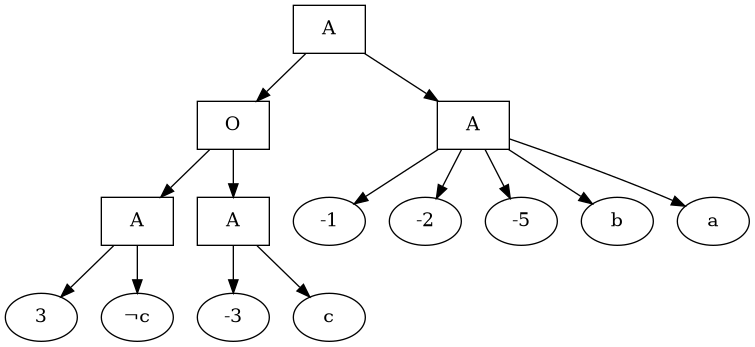
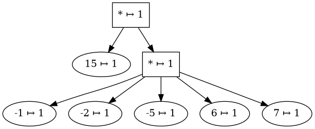
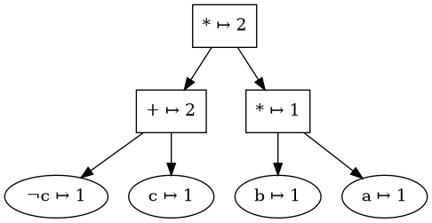

# nnf-to-dot (nnftd)


transforms (answer set) counting graph of nnf or nnf file to .dot file

# Usage
## nnf 
```command
$ nnftd example.nnf | dot -Tpng > example_nnf.png
```

## counting graph 
```command
$ nnftd example.cg | dot -Tpng > graph.png
```


## answer set counting graph 
```command
$ nnftd example.cg | dot -Tpng > graph.png
```

