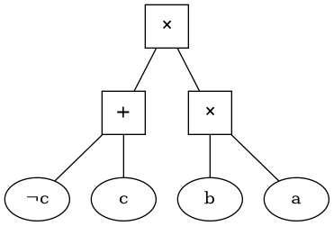

# nnf2dot
Converts NNF or counting graph to graphviz input.

# Build 
```console
nnf2dot$ ghc -o nnf2dot Main.hs
```
# Usage 
nnf2dot can be used on NNFs amd counting graphs in formats accepted by [iascar](https://github.com/drwadu/iascar).
## NNF
```console
nnf2dot$ ./nnf2dot examples/example.nnf | dot -Tpng > nnf_example.png
```

## Counting Graph
```console
nnf2dot$ ./nnf2dot examples/example.ccg | dot -Tpng > ccg_example.png
```



# Customize Style
To customize node styles, go to [Main.hs](Main.hs) and change either of 
```haskell
andNodeStyle   = "[label=∧ shape=box width=0.5]"
orNodSetyle    = "[label=∨ shape=box width=0.5]"
plusNodeStyle  = "[label=\"+\" shape=box fontsize=16 width=0.5]"
timesNodeStyle = "[label=\"✕\" shape=box fontsize=20 width=0.5]"
```
See [graphviz docs](https://graphviz.org/documentation/) for more.